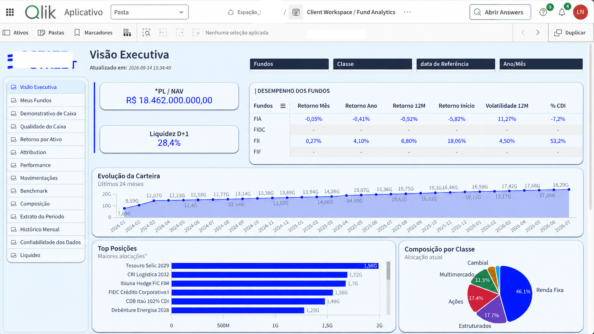
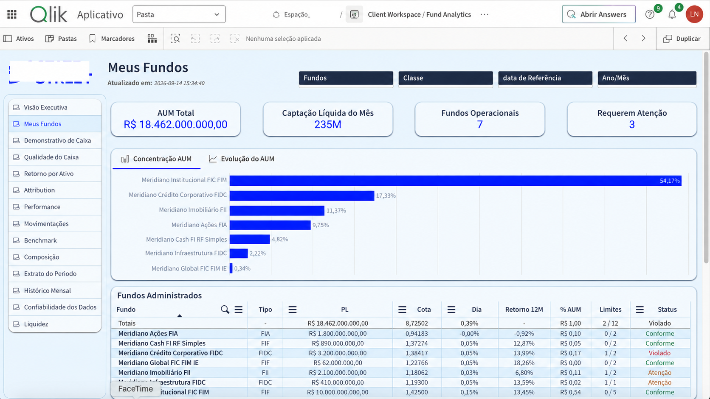
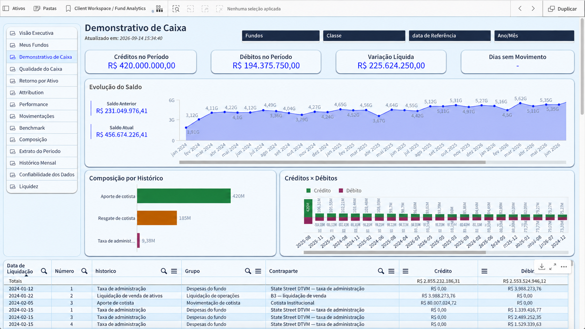

# Investment Fund Analytics


> Public portfolio case focused on investment fund analytics in Qlik. The repository intentionally exposes only selected views while additional analytical modules remain under development.

## Overview

This project presents a Qlik-based analytical application for monitoring investment funds, combining executive portfolio visibility, fund-level monitoring, cash analysis, performance indicators, liquidity metrics, allocation views, and operational status tracking.

The public version is intentionally concise. It highlights three core analytical areas that best represent the current stage of the solution:

1. **Executive Overview**
2. **My Funds**
3. **Cash Statement**

## Business objective

The solution is designed to support portfolio monitoring and fund management by consolidating key indicators in a single analytical environment.

Current analytical coverage includes concepts such as:

- NAV / AUM monitoring
- portfolio evolution
- monthly and annual returns
- 12-month return
- volatility
- CDI comparison
- liquidity
- asset allocation
- concentration by fund
- fund status and limits
- cash inflows and outflows
- cash balance evolution

## Selected dashboard views

### 1. Executive Overview

The Executive Overview consolidates the main portfolio indicators and provides a high-level view of fund performance and allocation.

The published view includes:

- PL / NAV
- D+1 liquidity
- return by fund class
- volatility
- CDI comparison
- 24-month portfolio evolution
- top positions
- portfolio composition by asset class



### 2. My Funds

The My Funds view supports fund-level monitoring and concentration analysis.

The current implementation includes:

- total AUM
- monthly net inflow
- number of operational funds
- funds requiring attention
- AUM concentration by fund
- fund-level status and limit monitoring



### 3. Cash Statement

The Cash Statement view focuses on liquidity movements and cash behavior.

The current implementation includes:

- credits in the period
- debits in the period
- net cash variation
- current and previous balance
- cash balance evolution
- cash flow composition
- credit versus debit comparison



## Modules in development

The application also includes additional analytical areas that are still being developed and are intentionally not fully exposed in this public repository.

These modules include:

- Cash Quality
- Return by Asset
- Attribution
- Performance
- Movements
- Benchmark Analysis
- Portfolio Composition
- Period Statement
- Monthly History
- Data Reliability
- Liquidity

Their presence in the solution roadmap reflects the broader objective of evolving the app from portfolio monitoring into a more complete fund analytics platform.

## Qlik development

The project includes work with:

- Qlik data modeling
- calculated measures and KPIs
- Set Analysis
- variables and dynamic expressions
- date-based portfolio analysis
- benchmark logic
- fund and class filters
- analytical navigation across multiple business views

## Analytical concepts

A simplified analytical flow can be represented as:

```text
Fund / Portfolio Data
        |
        v
Qlik Data Preparation
        |
        v
Associative Data Model
        |
        v
Business Rules & Measures
        |
        v
Portfolio / Fund Analytics
        |
        +--> Executive Monitoring
        +--> Fund Monitoring
        +--> Cash Analysis
        +--> Performance & Benchmark Modules
```

## Portfolio scope

This repository is a curated portfolio case and does not represent the complete internal application.

The public version intentionally excludes:

- confidential source data
- production credentials
- internal connection details
- proprietary data files
- full client-specific implementation details

Only selected screenshots and generalized analytical documentation are published.

## Repository structure

```text
.
├── README.md
└── screenshots/
    ├── README.md
    ├── 02-executive-portfolio-composition.png
    ├── 03-my-funds-overview.png
    └── 05-cash-statement-overview.png
```

See [Screenshot Evidence](screenshots/README.md).

---

**Portfolio project by Luiz Felipe Nunes — BI Developer | Qlik | SQL | Data Analytics**
